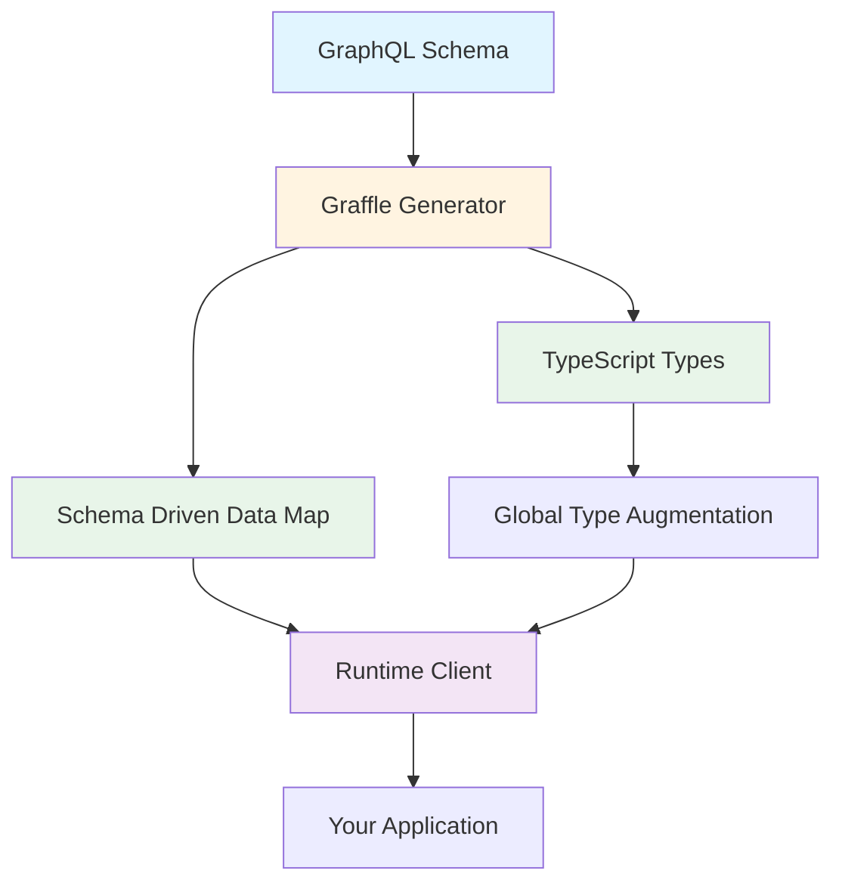

# Generation <GeneratedClientBadge />

This guide is an overview of using generation. Individual features enabled by generation are discussed in other guides. There is a [practical tutorial in getting started](../20_getting-started.md). But if you're trying to build a mental model of what Graffle means when it talks about generation or generally want more detail on generation tools, then this guide is for you.

## Benefits

If you haven't read the [introduction](../index.md), here is a recap of benefits from generation:

<!--@include: @/_snippets/benefits.md-->

## Architecture

The generator transforms your GraphQL schema into TypeScript code that augments Graffle's runtime client. At build time, the generator analyzes your schema and outputs type definitions and minimal runtime data. At runtime, Graffle uses this generated code to provide type-safe APIs.



**Components:**

- **Generator**: CLI or API that parses your schema and generates code
- **TypeScript Types**: Generated types that provide IDE autocomplete and type checking
- **Global Type Augmentation**: Types that extend Graffle's core types via TypeScript's module augmentation
- **SDDM**: Optional runtime data structure for features like custom scalars and schema errors (only included if needed)
- **Runtime Client**: Graffle's core client that reads the generated types via Proxy to provide type-safe methods

The key insight is that most of the generated code is types, not runtime code. This keeps bundle sizes small while providing full type safety.

## Multiple Clients

Sometimes you need to work with multiple schemas in one project, for example imagine having to use both the Shopify API and GitHub API. In such a case you may want to name your clients differently. Naming them has the advantage of changing the generated namespace name making it easier for you to auto-import. For that matter even when using a single client you may prefer to name it semantically.

Here is an example walkthrough.

1. You generate a client for GitHub. The default output goes to `./github`.

   ```sh
   pnpm graffle --name Github --schema '...'
   ```

2. You can now import from it:

   ```ts
   import { Github } from './github/index.js'

   const github = Github.create({
     transport: { headers: { authorization: '...' } },
   })

   const repos = await github.query.viewer({ repos: { name: true } })
   ```

## CLI

Typically you will use the CLI to generate a client. After installing `graffle` you will have access to a CLI also named `graffle`.

```bash
pnpm add graffle
pnpm graffle --schema '...'
```

The CLI has built in help that you can use to learn about all its inputs.

```bash
pnpm graffle --help
```

## Configuration File

The CLI will by default look for a `graffle.config.{js,ts,mts,mjs}` file in your project.

When Graffle finds your configuration module, it will look at the default export for your configuration.

Any arguments you provide on the command line will take precedence over the configuration file.

**TypeScript Configuration Files:**

With **Node.js 24.0+** or **Node.js 22.18+**, TypeScript config files work natively using Node's built-in type stripping. No additional setup required.

**Advanced TypeScript Features:**

If your config file uses or imports code with advanced TypeScript features (enums, namespaces, parameter properties), you have two options:

1. **Use Node's transform flag** (recommended):
   ```bash
   NODE_OPTIONS=--experimental-transform-types pnpm graffle
   ```

2. **Use tsx** (for fully stable transformation):
   ```bash
   GRAFFLE_USE_TSX=1 pnpm graffle
   ```
   Requires `tsx` installed locally (`pnpm add -D tsx`) or globally.

**Older Node Versions:**

For Node.js versions older than 22.18, you must install and use `tsx`:

```bash
pnpm add -D tsx
GRAFFLE_USE_TSX=1 pnpm graffle
```

Example:

```ts
// graffle.config.ts
import { Generator } from 'graffle/generator'

export default Generator.configure({
  lint: {
    missingCustomScalarCodec: false,
  },
})
```

## API

If you need to script graffle client generation then you can use the underlying Graffle generator API. It is largely one-to-one with the CLI. Use its JSDoc to learn about all its inputs.

```ts
import { Generator } from 'graffle/generator'

await Generator.generate({
  // ...
})
```

## Global Defaults

For advanced use cases like testing, you can mutate global generator defaults at runtime. This is useful when you want to suppress warnings or change default behaviors without passing configuration to each generator call.

```ts
import { Generator } from 'graffle/generator'

// Suppress custom scalar warnings globally (useful in test suites)
Generator.defaults.lint.missingCustomScalarCodec = false

// All subsequent generation will use the modified defaults
await Generator.generate({ schema: '...' })
```

**Use cases:**

- **Testing**: Suppress warnings in test suites to keep output clean
- **Scripting**: Set defaults once for multiple generator runs
- **CI/CD**: Configure build-time behavior without config files

**Note**: Changes to `defaults` affect all generator calls in the same process. These are _global_ defaults that can still be overridden by explicit configuration:

```ts
// Global default
Generator.defaults.lint.missingCustomScalarCodec = false

// Explicit override takes precedence
await Generator.generate({
  lint: { missingCustomScalarCodec: true },
  schema: '...',
})
```
